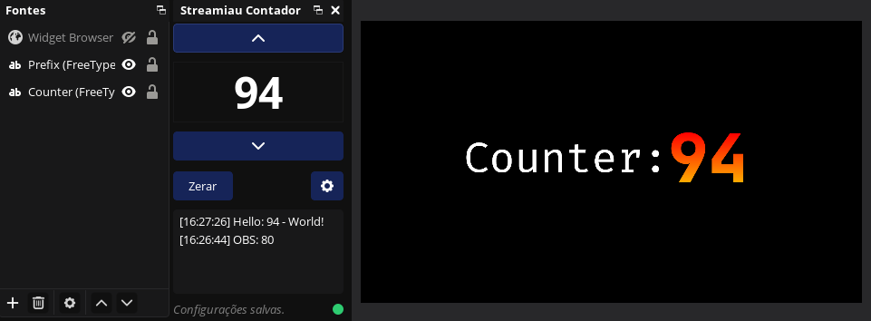

# Streamiau Counter - OBS Plugin

A plugin for OBS Studio that adds a counter dock with a change history, integration with a **Text (GDI+ / FreeType 2)** source via file, and real-time sync over **WebSocket**.

## Preview

## Plugin Template Documentation

All documentation can be found in the [Plugin Template Wiki](https://github.com/obsproject/obs-plugintemplate/wiki).

Suggested reading to get up and running:

* [Getting started](https://github.com/obsproject/obs-plugintemplate/wiki/Getting-Started)
* [Build system requirements](https://github.com/obsproject/obs-plugintemplate/wiki/Build-System-Requirements)
* [Build system options](https://github.com/obsproject/obs-plugintemplate/wiki/CMake-Build-System-Options)
